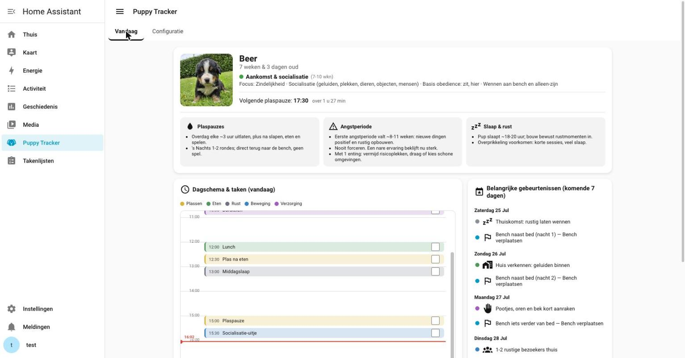

# 🐶 PuppyTracker

A Home Assistant custom integration to guide a puppy through its first months:
developmental **phases**, a 24-hour **day schedule**, a **socialization program**,
and shiftable **care schedules** — defer one step and the rest of that schedule
cascades along. It adds its own sidebar panel; no add-on, no separate backend.

Interface and default content available in **Dutch and English**.

[](https://my.home-assistant.io/redirect/hacs_repository/?owner=e11en&repository=PuppyTracker&category=integration)



## Features

- **Today** — a hero card (photo, age, active phase, next potty break) with the
  current phase's info cards, a day-view timeline with a live "now" line, and the
  important events of the coming 7 days.
- **Phases** — age-based phases (7-12 wk and beyond) with focus areas, potty
  interval and info cards; fully editable.
- **Socialization** — a weekly checklist (weeks 1-5), current week highlighted,
  past weeks dimmed; move activities between weeks.
- **Schedules & tasks** — one-off tasks (e.g. vet) and multi-step protocols
  (e.g. moving the crate) with **cascade-defer**.
- **Native entities** — `sensor` (age / phase / next potty break) and a `todo`
  checklist for today, usable in any dashboard and in Assist.
- **Bilingual** — switch the language on the Configuration tab; reload the
  default content in the chosen language.

## Installation

### HACS (recommended)

1. In HACS, add this repository as a **custom repository** (category: Integration)
   — or use the badge above.
2. Install **PuppyTracker**, then restart Home Assistant.
3. Go to **Settings → Devices & Services → Add Integration → Puppy Tracker** and
   fill in the puppy's name, birth date and homecoming date.
4. Open **Puppy Tracker** from the sidebar.

### Manual

Copy `custom_components/puppy_tracker/` into your Home Assistant
`config/custom_components/` directory and restart Home Assistant, then add the
integration as above.

## Local development & contributing

Contributions are welcome. A local Home Assistant dev environment is included.

```bash
# 1. Start Home Assistant with the integration mounted
docker compose up -d              # http://localhost:8123

# 2. Build the sidebar panel (Lit + Vite)
cd cards
npm install
npm run build                     # builds and copies the bundle into the integration
npm run typecheck

# 3. Run the backend tests (cascade-defer logic)
python -m venv .venv && ./.venv/bin/pip install aiosqlite pytest
./.venv/bin/python -m pytest tests/
```

After changing the cards, **restart Home Assistant** (`docker compose restart`)
so the panel's cache-busted URL updates and a normal browser reload picks up the
new bundle. See [`CLAUDE.md`](CLAUDE.md) for architecture, the data model, the
WebSocket API and deploy notes.

**Guidelines**: code and comments in English; UI strings go through the `I18N`
map, content (phase/socialization/schedule text) stays user-editable in the UI
(never hardcode it in the panel); commit the built bundle under
`custom_components/puppy_tracker/frontend/`.
